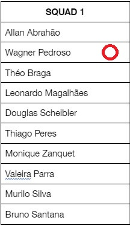

# Projeto 2 Módulo 2 - DevinHouse

Desenvolvido pela SQUAD 1 - Turma DevInHouse.

## 🚀 Descrição

Essas instruções permitirão que você obtenha uma cópia do projeto em sua máquina local para fins de desenvolvimento e testes.

O objetivo deste documento é facilitar a compreensão do escopo do projeto e de como funciona.

### 📋 Requisitos Funcionais

Aplicativos e ferramentas que devem estar instalados e executando:

## Exemplo a ser seguido:

https://www.figma.com/file/e1bWIIr30OjndaBWNiir4Y/Dev-agro?node-id=0%3A1.

### 🔧 Download Projeto (Github)

Em seu servidor local baixe o projeto usando o comando:

git clone https://github.com/DEVin-Senior/M2P2-DEVAgro-Squad01.git

### 🔧 Instalação Detalhada

Um exemplo passo-a-passo para informar o que você deve executar para montar o ambiente de desenvolvimento e a aplicação completa.

Abra seu Visual Studio Code, abra o terminal Git-Bash, selecione a pasta onde você deseja fazer o clone do projeto. 

Digite o comando:

git clone https://github.com/DEVin-Senior/M2P2-DEVAgro-Squad01.git

Aguarde o download terminar. 

Você abrirá o terminal Gitbash dentro do Visual Studio Code, para instalar o servidor de autenticação.

Navegue até a pasta Auth-server com o comando:

cd auth-server 

Para instalar o servidor, use com comando:

npm i > ou npm install = instalar o servidor de autenticação.

Aguarde terminar a instalação do servidor de autenticação, use o comando: 

npm start = Para iniciar o servidor de autenticação.

Abra um novo terminal Gitbash dentro do Visual Studio Code, para instalar e iniciar a aplicação.

Usando o comando: 

cd devagro-frontend/ 

Para entrar na pasta devagro-frontend, posteriormente digite o comando:

npm i > ou npm install = instala o projeto

Aguarde terminar a instalação o projeto e inicie a aplicação com o comando: 

ng s ou ng serve = inicia o projeto já instalado com Angular.

Abra seu navegado no link descrito no terminal da aplicação, geralmente:

http://localhost:4200/

Efetue seu login com usuário e senha cadastrado no servidor de autenticação.

Login: adm@devagro.com.br

Senha: dev123

Bem-vindo ao pagina home do sistema.

## 📦 Desenvolvimento

Desenvolvido por Wagner Pedroso.

24/07/2022 Ultimas modificações, entraga final do projeto.

## 🛠️ Tecnologias utilizadas

- NodeJS (Versão 16.15.1 ou Superior).

- NPM (8.12.1 ou Superior).

- Angular (14.0.0 ou Superior).

- LocalStorage - Armazenamento dos dados. 

* [AppComponent](https://cdn.jsdelivr.net/npm/bootstrap@5.2.0-beta1/dist/css/bootstrap.min.css) - bootstrap - Framework web utilizado / Confirmar.
 
## 🖇️ Colaborando

Por favor, leia o [README.md] (https://github.com/DEVin-Senior/M2P2-DEVAgro-Squad01/blob/main/README.md) para obter detalhes sobre o nosso código.

## 📌 Versão

Versão do projeto 1.0 - Desenvolvido pelo SQUAD 1!

## ✒️ Autores

Todos aqueles que ajudaram a levantar o projeto desde o seu início.

* **Wagner Pedroso** - [Desenvolvedor] (https://github.com/wagnerpedroso)

Você também pode ver a lista de todos os [Colaboradores] (https://padlet.com/franciscosantana4/733h4p7nyk1lmbpn) que participaram deste projeto e da turma DevInHouse com mais detalhes.

## 🎁 Expressões de Gratidão

Obrigado a todos que participaram e ajudaram esse projeto á ser desenvolvido.